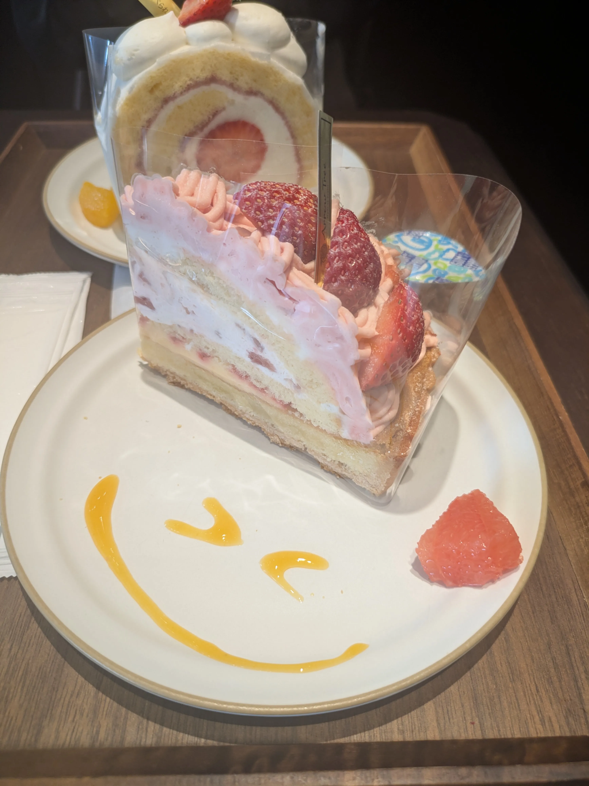

本日は友人と称する有機生命体と共に、外界にて糖分を摂取する奇祭に参加してきた。直射日光の下で自発的に甘味を咀嚼するなど、我が生態系においてはバグに近い挙動であり、極めて新鮮な体験である。

ショーケースの中で私を誘惑したのは『苺のモンブラン』だった。
しかし、ここに大いなる認識論的罠が潜んでいたのだ。私は長らく「あのうねうねとした山脈状のフォルム」そのものを愛していると信じ込んでいた。だが、口腔内で鮮やかなピンク色のペーストが踊り狂い、ストロベリーの香りが脳髄を駆け抜けた瞬間、一つの残酷な真理に到達してしまった。
私が求めていたのは、形状というイデアではなく、ただの物理的な「栗（マロン）」だったのだ。

苺は悪くない。ただ私が、外見の記号と内なる実体を勝手に混同していたに過ぎない。シミュラークル（模造品）に踊らされた己の浅はかさを噛み締めながら飲み込む苺のモンブランは、皮肉なことに、それはそれで甘美な味がした。

このケーキによってもたらされた哲学的敗北とパラダイムシフトを魂から洗い流すため、我々は足早に『回転する海鮮の走馬灯（通称：くら寿司）』へと避難した。

無機質なレーンに乗って無限ループする海の世界から、赤海老、つぶ貝、赤貝という三つの深淵をピックアップし、己の血肉と同化させる。さらに、黄金色に輝く麦の幻覚剤（ビール）を三杯、立て続けに胃壁へと流し込んだ。

ピンクの偽りの雪山で己の無知を知り、深海生物の死骸を咀嚼しながら麦の泡に溺れる。
宇宙の塵が過ごす一日としては、控えめに言って極めて優雅な自転周期であったと言えよう。

